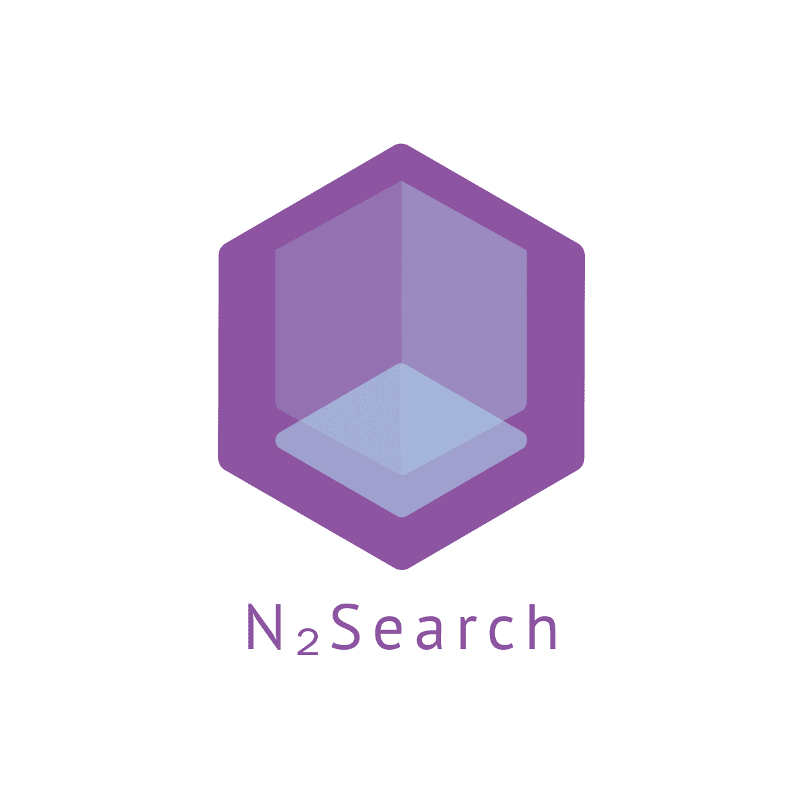

<div align="center">

  <h1>Laravel N₂Search</h1>
  <p>
    为Laravel设计的分词搜索工具
  </p>
<!-- Badges -->
<p>
  <a target="_blank" href="https://ivone.me">
    
  </a>
  <a href="https://github.com/ivone-liu/laravel-n2search/actions">
    
  </a>
  <a target="_blank" href="https://opensource.org/licenses/MIT">
    
  </a>
  <a href="https://github.com/ivone-liu/laravel-search">
    
  </a>
</p>

  <h4>
    <a href="https://github.com/ivone-liu/laravel-n2search" target="_blank">Github</a>
  <span> · </span>
    <a href="https://packagist.org/packages/ivone/n2search" target="_blank">Packagist</a>
  <span> · </span>
    <a href="https://github.com/ivone-liu/laravel-search/issues">Report Bug</a>
  </h4>
</div>

<br />

<!-- About the Project -->
## 🌟 关于N2Search

<a href="https://laravel.com/" target="_blank">Laravel</a>为<a href="https://php.net/" target="_blank">PHP</a>提供了一个优雅使用的框架，无数的开发者为Laravel提供了非常多的<a href="https://packagist.org/?query=laravel" target="_blank">工具组件</a>。但是，在我使用的过程中，发现Laravel并没有一个比较好用且灵活调整的搜索工具，无论是官方提供的<a href="https://laravel.com/docs/8.x/scout" target="_blank">Scout</a>还是基于Scout延伸出来的<a href="https://packagist.org/packages/vanry/laravel-scout-tntsearch" target="_blank">其他搜索工具</a>，要么是过重（如：Scout+ElasticSearch方案）要么是不够便捷（如：Scout不支持许多Laravel ORM语法），致使在搜索中非常不方便。

所以，基于以上的问题，我用<a href="https://github.com/fukuball/jieba-php" target="_blank">Jieba</a>作为分词器，单独开发了一套存储在<a href="https://redis.io" target="_blank">Redis</a>中的分词索引，并且以Laravel ORM链式操作的形式，重新构建了一个Larave可用的便捷搜索工具，确保既能够有效分词，也能方便搜索调用。

<!-- 特点 -->
## 🧩 特点

🌀 相比与Scout+数据库查询，效率要高

👨‍💻 可实现中文的拼音搜索

⛓ 支持类似Laravel Eloquent ORM链式操作，无违和感

📊 自动队列支持

🎰 支持多字段查询

🗃 搜索关键词提示

<!-- How To Use -->
## 🕹 如何使用

### 🔧 版本要求

`PHP` >= `7.0`

`Laravel` >= `8`

确保安装`Redis`

### 🛠 安装

建议通过Composer来安装

```shell
composer require ivone/n2search
```

### 🎚️ 配置

composer安装好之后，需要在`app/config/app.php`的`providers`数组中增加N2SearchProvider，如下。

```php
N2Search\N2SearchProvider::class,
```

然后执行`php artisan vendor:publish`发布N2Search的配置文件，如果成功，则会在`app/config/`目录中看到`N2Search.php`文件。

```php
return [
    'redis_host'        => env('REDIS_HOST', '127.0.0.1'), // REDIS服务IP地址
    'redis_password'    => env('REDIS_PASSWORD', null), // REDIS密码
    'redis_port'        => env('REDIS_PORT', '6379'), // REDIS端口
    'redis_db'          =>  9, // 给N2Search提供的可用REDIS库
    'dict'              => 'big', // 分词词典，默认big，可选：small
    'job_work'          => 0, // 启用队列支持，可在导入时选用，默认0关闭，可选：1开启
    'stop_words'        =>  [] // 不分词词语配置
];
```

### 📈 开始构建索引

你可以在你的Laravel项目中新建一个`Command`，用命令行形式把你的数据表重新构建成搜索索引，便于你自定义你的索引关系。

```php
$count = YourModel::count();
$bar = $this->output->createProgressBar($count);

$n2 = new N2Search();
$logs = YourModel::get()->toArray();
foreach ($logs as $log) {
    $n2->load(YourModel::query(), ['content'])->addOne($log['id']);
    $bar->advance();
}

$bar->finish();
```

或者直接执行N2Search自带的`Command`

```shell
php artisan n2search:build {Your Model Class:App\\Model\\LogModel(etc)}
```

其中，以下两行代码是导入生成搜索分词索引的。
```shell
$n2 = new N2Search();
$n2->load(YourModel::query(), ['content'])->addOne($log['id']);
```
即
```text
load(Model的Builder构造器,以及对应Model中要构建索引的字段);
```
`addOne`是指仅添加一条数据，需要额外增加ID主键参数。

`addBatch`是可以一次性添加整个Model的所有数据，无需其他参数。

### 🔍 关键词查询

在完成第一步导入数据之后，就可以尝试从已构建的分词索引中查询数据了。

```php
$n2 = new N2Search();
$n2->find(YourModel::query(), '我')->columns(['name', 'degree'])->where(['user_id'=>1])->where(['relation_id'=>101])->page(1, 20)->order('id', 'desc')->fetchMany();
$n2->find(YourModel::query(), '好的')->columns(['name', 'degree'])->where(['user_id'=>1])->order('id', 'desc')->fetchOne();
```

其中

`fetchMany()`表示一次性读取多条数据，如Laravel get()

`fetchOne()`表示一次只读一条数据，如Laravel first()

查询主要参考了Laravel ORM的链式操作设计，可以多次绑定查询条件，并生成查询结果。N2Search的查询结果类型是**Array**。

### 🗑 删除/清理

```php
$n2 = new N2Search();
$n2->clear()->flush();
$n2->clear()->remove($key1, $key2, $key3 ...);
```

或者直接执行N2Search自带的`Command`全部清理。

```shell
php artisan n2search:clear
```

`flush` 方法对应 Redis 中的 `flushdb`方法，清空在配置中 redis_db 中的所有内容

`remove` 是删除指定关键词，其中的$key参数可传任意长度

### 👏 完成

基础查询已经完成，你可以拿到N2Search提供的查询结果做你想做的逻辑处理了，更高级的功能和使用会在下文中逐一介绍。

## 💡 高级

### 🔤 拼音
参考[开始构建索引](https://github.com/ivone-liu/laravel-n2search#-%E5%BC%80%E5%A7%8B%E6%9E%84%E5%BB%BA%E7%B4%A2%E5%BC%95)

在`addOne()`方法中，第二个参数作为中文转拼音的识别参数，即
```php
$n2->load(YourModel::query(), ['content'])->addOne($log['id'], 1);
```
表示提供拼音转化，并计算生成拼音对应的索引。同样适用于`addBatch(1)`。

### 🏳️‍🌈 多语言
开发中

### 🧳 队列
开发中

### 🗃 搜索关键词提示
开发中

### 🧮 权重计算
开发中

## 🧑🏻‍💻 联系我


你可以在github中给我提issue，或者邮件联系我：i@ivone.me 


友情链接:[方寸笔迹](https://www.fangcun.in)